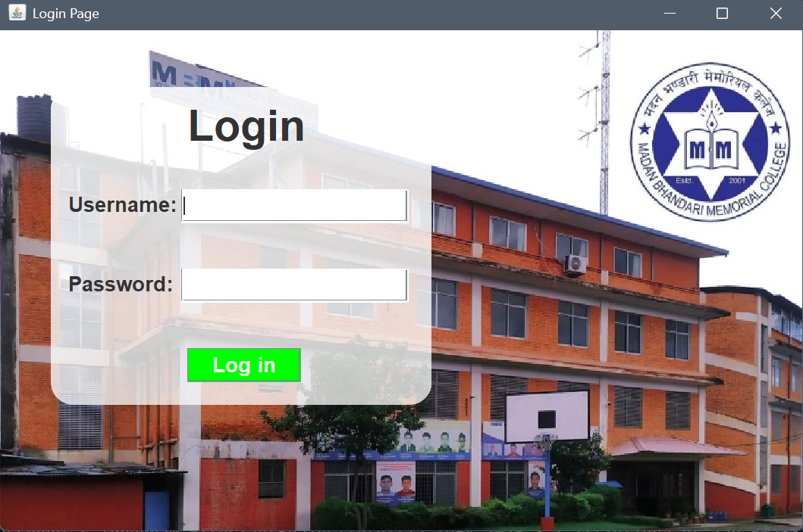

# Student Management System 


### This project is a Java-based desktop application developed using **Java Swing**.

## Current Features

* Login Page UI using Java Swing
* Username and Password input fields
* Login button interface
* Image/logo integration
* Basic window configuration and layout management

---

## Technology Stack

* Java (JDK 25)
* Java Swing (GUI)
* IntelliJ IDEA
* Git & GitHub

---

## Project Structure

```
src/
 ├── Authentication/
 │     └── LoginPage.java
 └── imgs/
       └── ClzLogo.jpg
```
---

## Screenshots

### Login Page




---

## Author

**Nayan Pokharel**

---

## Status

🚧 Project in Development

