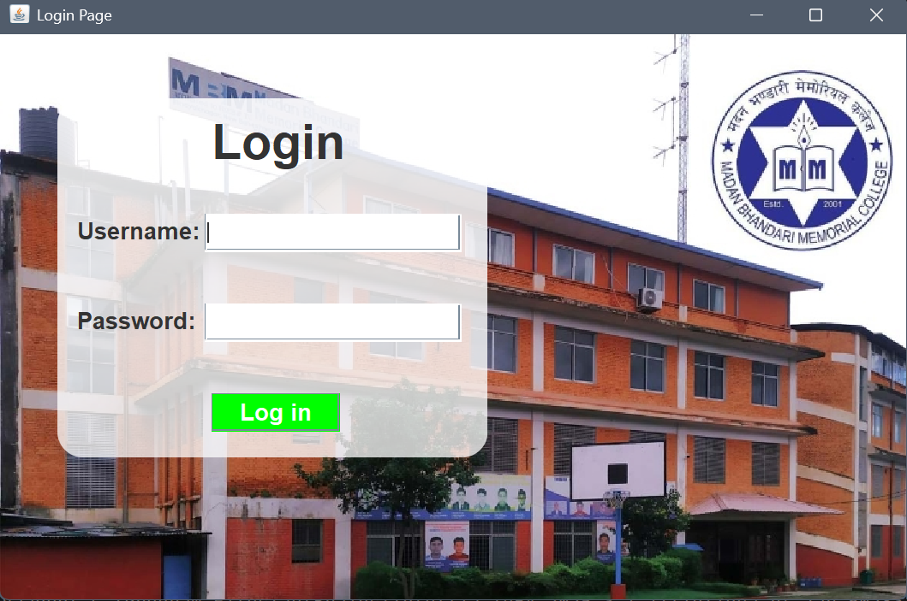
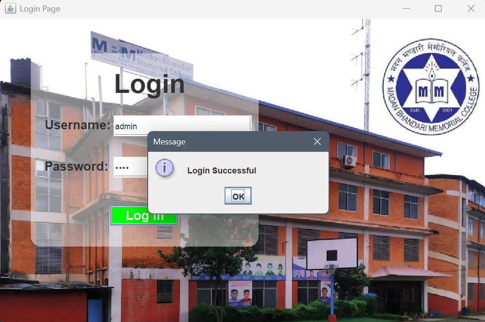
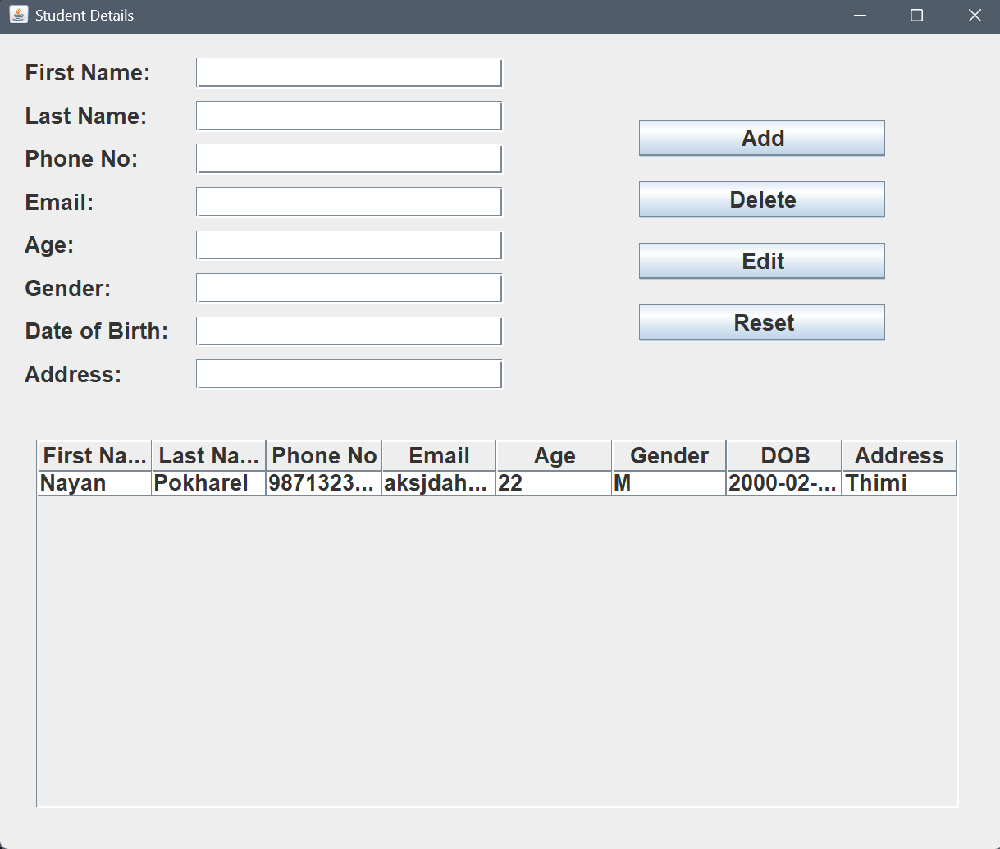

# Student Management System 


### This project is a Java-based desktop application developed using **Java Swing**.

## Current Features

* Login Page UI using Java Swing
* Username and Password input fields
* Login button interface
* Basic Crud operation
* Database connection with MySql

---

## Technology Stack

* Java (JDK 25)
* Java Swing (GUI)
* IntelliJ IDEA
* Git & GitHub

---

## Project Structure

```
SWING
├── .idea/
├── Screanshots/
├── src/
│   ├── Authentication/
│   │   └── LoginPage.java
│   ├── Connection/
│   │   └── Dbconnection
│   ├── Controller/
│   │   └── StudentController
│   ├── Model/
│   │   └── StudentModel
│   ├── DAO/
│   │   └── StudentDAO
│   ├── View/ 
│   │   └── Main
│   │   └── StudentView
│   └── imgs/
│       ├── bg.png
│       ├── BuildLogo.jpg
│       └── ClzLogo.jpg
├── README.md

```
---

## Screenshots

### Login Page




---
### Login Success




---
### Student Detail




---

## Author

**Nayan Raj Pokharel**

---

## Status

🚧 Project in Development

